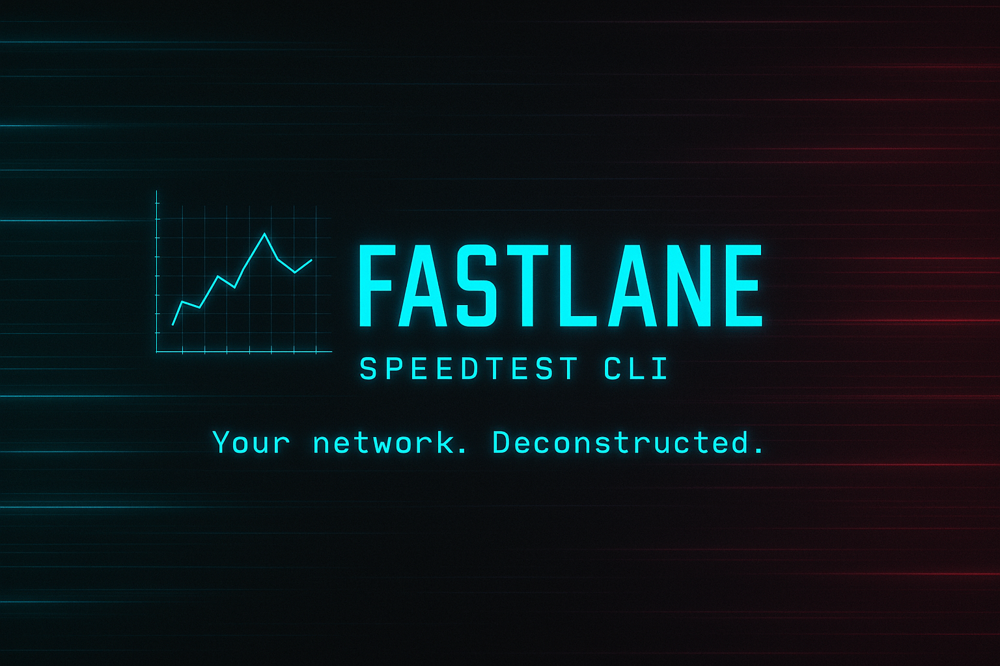

# Fastlane — Network Benchmarking CLI

> *Your network. Deconstructed.*
> Built for developers who hate lag.

A modular, cross-platform CLI that benchmarks ping, download, upload, and packet loss with verdict-led terminal cards and machine-readable JSON. No GUI, no sign-up, no telemetry.



---

## Install

```bash
go install github.com/atharvwasthere/Fastlane@latest
```

Pre-built binaries (linux/darwin/windows × amd64/arm64) are produced on every push from `.github/workflows/ci.yml` — grab the artifact or run `make cross-build` locally.

---

## Commands

```bash
fastlane ping [host]                  # layered DNS/TCP/TLS/HTTP latency + Pauta-filtered jitter
fastlane download [--auto-server]     # multi-stream HTTP throughput, CV-based convergence
fastlane upload   [--auto-server]     # symmetric to download, chunked POST
fastlane loss     [--mode http|udp]   # HTTP-HEAD probe by default; UDP echo gated for LAN use
fastlane test [host] [--ci ...]       # full ping → download → upload → loss suite with rating
fastlane live [host]                  # continuous dashboard cycling all four probes
fastlane servers list|probe|update    # inspect/probe/refresh embedded server catalog
fastlane report list|show|compare|trend  # local report archive (~/.fastlane/reports/)
fastlane version                      # build metadata (ldflags-injected)
```

### Global flags

```
--json            structured output (every command emits a parity JSON envelope)
--verbose         info-level logging on stderr
--debug           debug-level logging on stderr
--no-color        honor NO_COLOR convention (alongside the env var)
--timeout SECS    per-test deadline (defaults vary per command)
```

### Useful examples

```bash
# Honest CI-friendly run with thresholds
fastlane test --ci --min-download 50 --max-latency 100 --max-loss 1
echo $?   # 0 pass, 1 violated, 2 couldn't run

# Pick the nearest server via geoip+probing
fastlane download --auto-server

# Compare two saved runs
fastlane report compare 2026-05-13T11-02-15_download_speed.cloudflare.com \
                        2026-05-13T18-44-02_download_speed.cloudflare.com

# Plot the last 14 days of download throughput
fastlane report trend --metric download_mbps --days 14

# Prometheus exposition (drop into node_exporter textfile collector)
fastlane test --json --output prom > /var/lib/node_exporter/fastlane.prom
```

---

## How servers are picked

Two paths, chosen by flag:

| Mode | When | Cost |
|------|------|------|
| **Default** | No flag | Zero. Hits `speed.cloudflare.com`; anycast picks the edge. Best-effort colo lookup decorates the card subtitle (`colo=DEL loc=IN`). |
| **`--auto-server`** | Explicit | geoip (ipapi.co, 24h cache) → haversine sort embedded `servers.json` → top-5 shortlist + anycast fallback → parallel TCP probe (concurrency 8, 500ms timeout) → lowest RTT wins, 1h decision cache. |

The embedded catalog ships 22 verified LibreSpeed-compatible backends (NA, EU, JP, RU) plus Cloudflare anycast. Refresh from upstream with:

```bash
fastlane servers update    # fetch latest list, cache to ~/.fastlane/servers.json
fastlane servers probe     # rank all entries by RTT
```

**India / Asia note:** all major Indian ISPs migrated to Ookla's proprietary protocol — no open HTTPS backends. CF anycast routes IN traffic via Mumbai/Delhi/Chennai edges, which is generally the right answer. Self-host a LibreSpeed VPS in Mumbai/Bangalore if you need native IN coverage.

---

## Architecture

Three load-bearing layers; cross-cuts are blocked at review.

```
cmd/                → cobra wiring; depends only on internal/bench + pkg/render
cmd/internal/       → orchestration seam: factories, renderer selection, RunBench
internal/<bench>/   → measurement engines; each implements bench.Engine
pkg/render/         → lipgloss + bubbletea rendering, format-pluggable
```

`bench.Engine` is the single contract: `Run(ctx) (Result, error)`. Bandwidth engines extend with `Snapshot() bench.Snapshot` for live progress. The renderer never type-switches on `Kind` to decide *whether* to render — only *how*. See `.claude/skills/fastlane-architecture/SKILL.md` for the layering rule and SOLID checks per PR.

### Output formats

`pkg/render/` exposes a `Renderer` factory with four backends, picked by `--json` / `--output prom`:

- **Card** (default) — verdict-led terminal card with 3-col responsive metric grid + dim hint footer
- **JSON** — schema-locked envelope, parity-tested against the card
- **Prometheus** — textfile-collector friendly exposition
- **Live** — bubbletea program driven by `engine.Snapshot()` on a 150ms ticker (used by download/upload during their main run)

---

## Build

```bash
make build        # ./bin/fastlane with ldflags-injected version/commit/date
make test         # go test -v -cover ./...
make bench        # microbenchmarks
make cross-build  # 5-target matrix into ./bin/
make lint         # golangci-lint (optional)
```

A successful build embeds `git describe --tags --always --dirty` into the version banner — `fastlane version` shows commit + build date.

---

## Configuration

Precedence (highest wins): **flag → `FASTLANE_*` env var → `~/.fastlane/config.json` → built-in defaults**.

```jsonc
// ~/.fastlane/config.json
{
  "timeout": 30,
  "debug": false,
  "no_color": false
}
```

Reports persist to `~/.fastlane/reports/` whenever `--save-report` is passed. Server selection cache lives at `~/.fastlane/cache/`.

---

## Credits

- [LibreSpeed](https://github.com/librespeed/speedtest) — community speedtest backends; embedded catalog sources from upstream.
- [Cloudflare speed test](https://speed.cloudflare.com) — default endpoint via `__down`/`__up`.
- [charmbracelet/lipgloss](https://github.com/charmbracelet/lipgloss) + [bubbletea](https://github.com/charmbracelet/bubbletea) — TUI.
- [spf13/cobra](https://github.com/spf13/cobra) — command tree.

---

## License

See [LICENSE](./LICENSE).

Made with latency hate by **Atharv Singh**.
